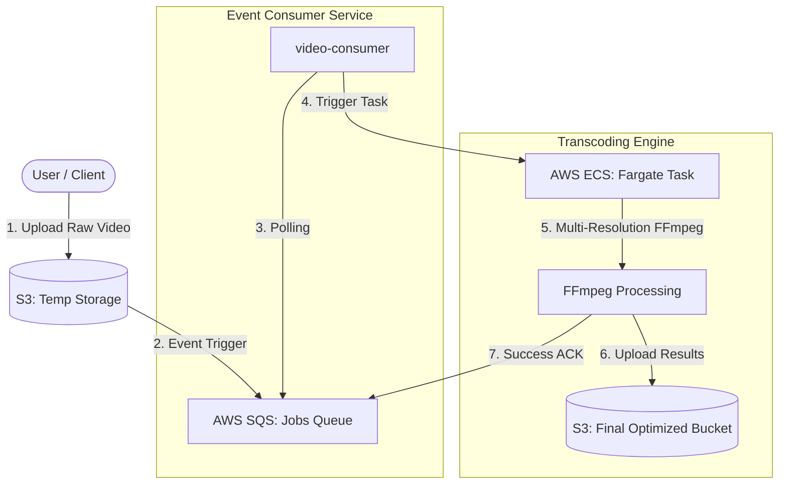

# 🎥 Scalable Video Transcoding Pipeline

[](#tech-stack)
[](https://opensource.org/licenses/ISC)
[](#system-architecture)

A production-grade, highly scalable video transcoding engine built on AWS serverless and container technologies. This system automates the process of converting raw video uploads into multiple resolutions optimized for web playback (360p, 480p, 720p, 1080p).

---

## 🏗️ System Architecture

The pipeline utilizes a **Producer-Consumer** pattern with asynchronous processing to ensure high throughput and fault tolerance.



### Key Engineering Principles
- **Reliable Handoff**: The SQS message is only deleted *after* a successful transcoding operation. If a container crashes, the message naturally reappears in the queue for a retry.
- **Resource Efficiency**: FFmpeg runs in a sequential loop within the Fargate container to prevent CPU/Memory thrashing and ensure stable execution on varied compute profiles.
- **Decoupled Configuration**: Infrastructure details are entirely externalized through environment variables, supporting multiple environments (Dev, Staging, Prod).

---

## ⚙️ Tech Stack

- **Runtime**: Node.js (TypeScript)
- **Processing**: FFmpeg (fluent-ffmpeg)
- **Containerization**: Docker
- **Cloud Infrastructure**: 
    - **AWS S3**: Durable staging and final media storage.
    - **AWS SQS**: Reliable message queuing with visibility timeouts.
    - **AWS ECS (Fargate)**: Serverless container execution for scalable processing tasks.

---

## 🚀 Getting Started

### Prerequisites
- Node.js (v18+)
- Docker (installed and running)
- AWS Account with permissions for S3, SQS, and ECS.

### 1. Environment Configuration
Copy the template and fill in your infrastructure details:
```bash
cp .env.example .env
```
Key variables required:
- `SQS_QUEUE_URL`: The full ARN/URL of your processing queue.
- `ECS_CLUSTER_NAME`: The target cluster for transcoding tasks.
- `ECS_TASK_DEFINITION`: The family/version of your Fargate task.
- `S3_DESTINATION_BUCKET`: Where output videos will be stored.

### 2. Setup Components

#### **Video Consumer**
The brain of the operation that monitors the queue and orchestrates tasks.
```bash
cd video-consumer
npm install
npm run dev
```

#### **Transcoder Builder (Dockerized)**
The FFmpeg engine. This image should be built and pushed to your ECR.
```bash
cd AWS-transcoder-builder
docker build -t video-transcoder .
```

---

## 📂 Repository Structure

```text
├── AWS-transcoder-builder/   # FFmpeg Docker environment & transcoding logic
├── video-consumer/           # SQS Poller & ECS Task orchestrator (TypeScript)
├── .env.example              # Centralized configuration template
└── README.md                 # System documentation
```

---

## 📈 Operational & Scaling Notes

- **Parallel Processing**: To handle higher spikes, simply increase the `count` in the ECS Service or run multiple instances of the `video-consumer`.
- **Fault Tolerance**: Ensure your SQS **Visibility Timeout** is set to at least 30 minutes to allow long videos time to finish transcoding.
- **Dead Letter Queues (DLQ)**: Recommended for production to capture "poison pill" files that consistently fail FFmpeg processing.

---

## 📄 License
This project is licensed under the ISC License.
